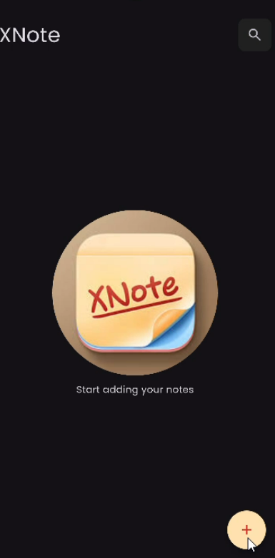
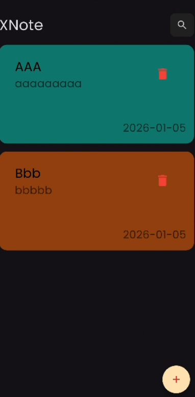
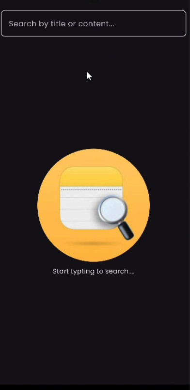
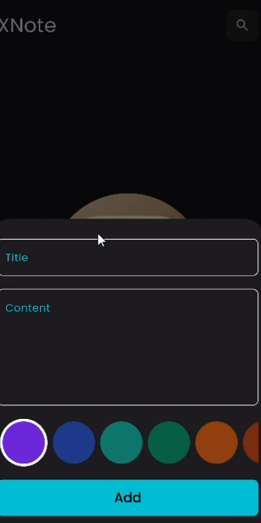
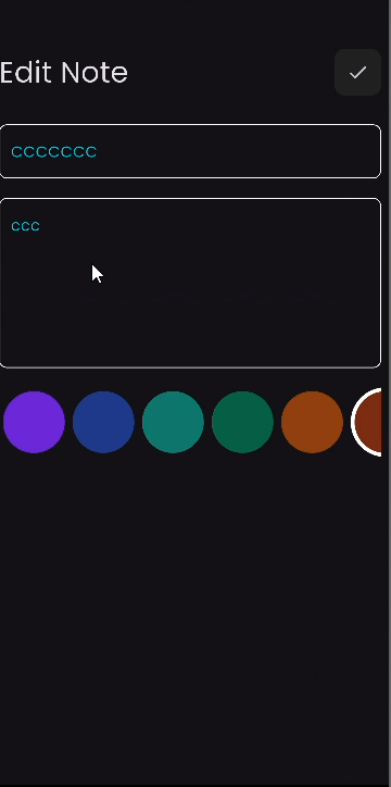

# 📝 XNotes — Notes App

> A clean and minimal notes app built with Flutter.  
> Create, edit, search, and organize your notes — all stored locally with Hive.

---

## 🎬 Live Demo

[](https://www.linkedin.com/posts/abdelrahman-siam-2a66072ba_flutter-dart-hive-activity-7413721323383803904-hu7W?utm_source=share&utm_medium=member_desktop&rcm=ACoAAEye2N4BxN3uf6ODo-UmeBYhDCm2KCGqw30)

---

## 📱 Screenshots

| Start | Home | Search |
|:-----:|:----:|:------:|
|  |  |  |

| Add Note | Edit Note |
|:--------:|:---------:|
|  |  |

---

## ✨ Features

### 📋 Notes Management
- Create new notes with title and content
- Edit existing notes
- Delete notes with confirmation
- Notes saved instantly to local storage

### 🔍 Search
- Real-time search by note title
- Instant results as you type

### 🎨 UI
- Animated start screen
- Color-coded notes
- Note creation date with intl formatting
- Loading indicator via modal_progress_hud
- Custom Poppins font

### 💾 Offline First
- All notes stored locally with Hive
- No internet connection required
- Data persists across app restarts

---

## 🏗️ Architecture(MVVM)

```
lib/
├── core/
│   ├── di/              # Dependency injection (get_it)
│   ├── theme/           # Colors & ThemeData
│   └── utils/           # Constants & helpers
│
└── features/
    └── notes/
        ├── data/
        │   ├── models/        # NoteModel (Hive object)
        │   └── datasources/   # Hive local datasource
        └── presentation/
            ├── cubits/        # NotesCubit, AddNoteCubit, SearchCubit
            └── views/         # Start, Home, Add, Edit, Search screens
```

### Data Flow

```
View (Widget)
    ↕
Cubit (State Management)
    ↕
UseCase
    ↕
Repository → Hive Local DataSource
```

---

## 🛠️ Tech Stack

| Category | Technology | Purpose |
|----------|-----------|---------|
| State Management | flutter_bloc (Cubit) | UI state handling |
| DI | get_it | Service locator |
| Local Storage | hive + hive_flutter | Offline notes persistence |
| Date Formatting | intl | Note creation timestamps |
| Loading | modal_progress_hud_nsn | Loading indicator on async actions |
| Fonts | Poppins | Custom typography |

---

## 💾 Hive — Notes Storage

```dart
@HiveType(typeId: 0)
class NoteModel extends HiveObject {
  @HiveField(0) String id;
  @HiveField(1) String title;
  @HiveField(2) String content;
  @HiveField(3) int color;
  @HiveField(4) DateTime createdAt;
}
```

```bash
# Generate Hive adapters
flutter packages pub run build_runner build
```

---

## 🚀 Getting Started

### Prerequisites
```
Flutter SDK >= 3.6.0
Dart SDK ^3.6.0
```

### Installation

```bash
# 1. Clone the repository
git clone https://github.com/AbdelrahmanSiam/note_app.git

# 2. Navigate to project
cd note_app

# 3. Install dependencies
flutter pub get

# 4. Generate Hive adapters
flutter packages pub run build_runner build

# 5. Run
flutter run
```

---

## 👨‍💻 Author

**Abdelrahman Siam**
Flutter Mobile Application Developer

[](https://linkedin.com/in/abdelrahman-siam-2a66072ba)
[](https://github.com/AbdelrahmanSiam)

📧 syamabdo382@gmail.com
📱 +201282387620
